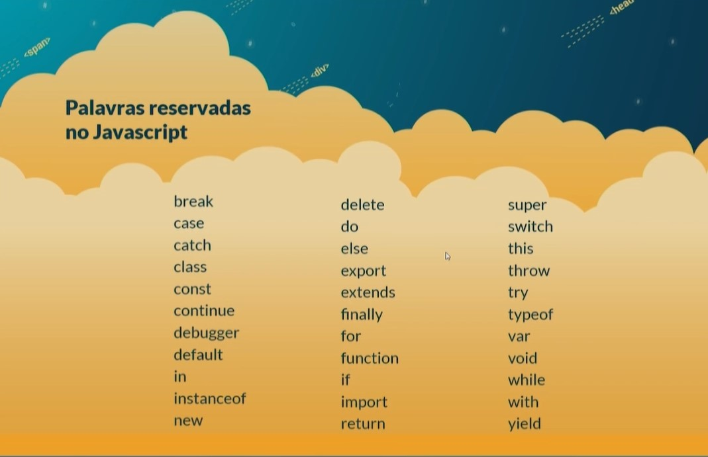
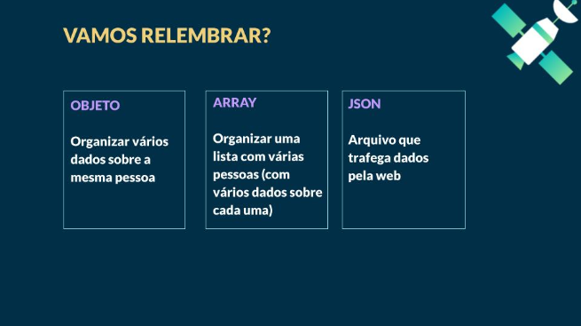
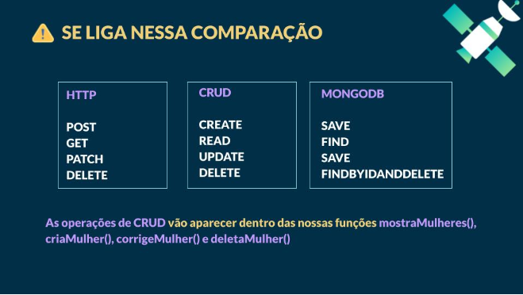

<<<<<<< HEAD
**CRIANDO O SERVIDOR (server.js)**
- Identificadores e palavras reservadas
           
           const porta = 3333 
  * const (o identificador, que nesse caso é uma constante, ou seja, indica que o valor nao vai mudar) 
  * porta (apelido do identificador) 
  * = (atribuição; associa o identificador com a porta) 
  * 3333 (valor da porta onde nosso servidor estará, esse valor será chamado durante a código, uma parte do endereço para acessar o servidor;)
Sendo assim, durante o código, basta chamar o apelido porta que saberemos que é sobre o endereço 3333

function mostraPorta () {
    console.log ("Servidor criado e rodando na porta", porta)
}
    * funcion (palavra reservada)
    * mostraPorta (nome da função)
    * console.log ('Servidor criado e rodando na porta') (conjunto de instruções)
    * porta (nome da variável ou apelido que vai chamar o endereço da porta, no caso a 3333)

**> Funções** são identificadores que guardam conjunto de instruções/comandos de ações para serem chamadas no nosso código

(Acima da cosntante porta:)
const express = require("express") 
   *crie uma constante de apelido/identificador express e para isso acesse o pacote node_modules e traga (através da função require) o pacote express para que eu possa utilizar sempre que necessário;
   o pacote express fornece a função chamada também express

   logo após, perto da constante da porta chamamos a contante app
         **const app = express()**
         identificador => atribuição => valor

*Mas o que faz o servidor rodar?*
        **app.listen(porta, mostraPorta)**
          * app.listen - chamando a função
          * porta - identificador porta
          * mostraPorta - chamando função sem parenteses
  "Computador, após você ouvir a porta (que está identificada na porta 3333) eu quero que você execute a função mostraPorta"

“Computador, vá no pacote do express e guarde todos os poderes de servidor do node na constante express. Agora, chame a função express para criar uma aplicação e guarde na constante app”.
"Depois a gente definiu o número da porta e a função mostraPorta. E por fim: “Computador, faça
esse app escutar, ou seja, chame a função listen, informando o endereço da porta e o identificador
da função mostraPorta”. Mas dessa vez sem parênteses. E eu queria te contar por quê. É que nesse
caso não é o nosso código que vai chamar a função mostraPorta, é o servidor que vai chamar
quando estiver funcionando. E o resultado esperado é a mensagem “servidor criado e rodando na
porta 3333”."

## Resumo de conceitos:

# Diferença entre API e CRUD

# Comparação de métodos:

